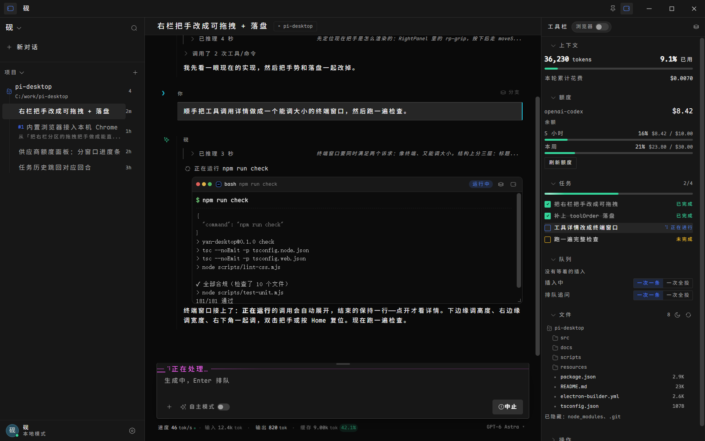
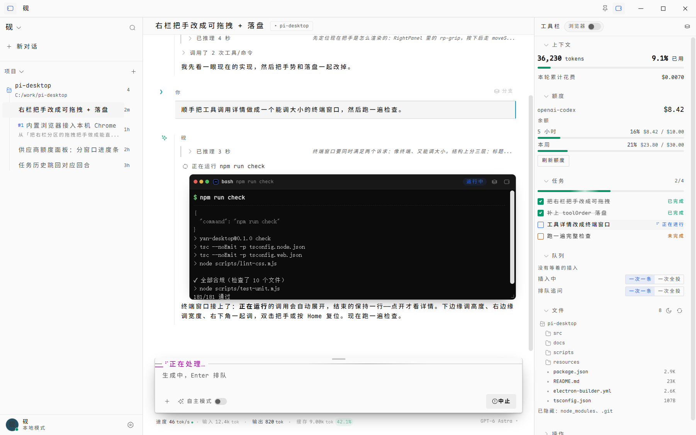
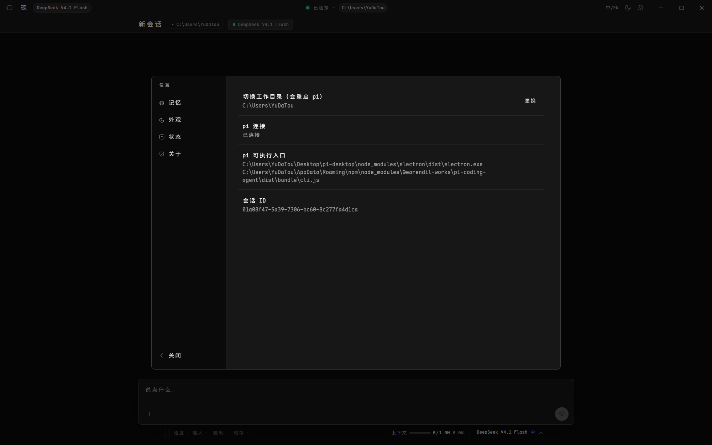

# 砚 · Yan

**个人 agent 的桌面端。记忆是第一公民。**

它是一个能日常使用的 **pi 客户端**：真连 `pi --mode rpc` 子进程，真的流式输出，
真的调工具，真的记得你 —— 并且把「它记的」和「它猜的」分开摆给你看



<sub>深色主题，真实会话。右侧是状态栏（上下文 / 任务 / 队列 / 环境），
输入框顶边框上的 `── ⠙ 正在处理… ──` 是工作状态，边框颜色跟着当前思考强度变</sub>

| 浅色主题 | 设置面板 |
|---|---|
|  |  |

---

## 前置要求

| | |
|---|---|
| **Node** | ≥ 20（开发时用的是 24） |
| **pi** | **已内置，无需自己安装**。运行时随应用分发（`resources/pi-runtime/`，约 20MB） |
| 平台 | Windows 优先（Windows 11 实测）；macOS / Linux 未实测 |

> 砚**不重写 pi 的会话格式**，它直接读 `~/.pi/agent/sessions/` ——
> 所以和 pi 的 TUI 是**互通**的：TUI 里聊过的会话桌面端左侧栏里能看到，反之亦然。
>
> 想用别的 pi 版本（或你全局装的那个）：设置里的 `piBin`，或环境变量 `YAN_PI_BIN`。

---

## 跑起来

```bash
npm install     # 依赖 + 字体（Maple Mono CN 走 npm，不需要额外步骤）
npm run dev
```

应用会自动找 pi 的位置；找不到时点标题栏中间的连接状态看诊断，或跑 `npm run probe-pi`。

> **字体**：早期版本要单独跑 `npm run font` 从本地拷一份 18.5MB 的 TTF，
> 而那个源文件同样不入库 —— 结果**新克隆的仓库根本跑不起来**
> （`@font-face` 静默回退，汉字格宽不再是 15.00px，整个等宽栅格塌掉且不报错）。
> 现在改成 npm 依赖 [`@mogeko/maple-mono-cn`](https://www.npmjs.com/package/@mogeko/maple-mono-cn)
> （239 个 `unicode-range` woff2 分片，按需加载），`npm install` 就位。
> 字体 SIL OFL 1.1，可随软件分发。

---

## 这跟别的 agent 客户端差在哪

一个聊天窗口 + 一个记忆面板不稀奇。区别在**记忆的认识论**：

| 设计 | 为什么 |
|---|---|
| 记忆分「**关于你**」（青色，你确认过）与「**我的印象**」（橙色，它自己猜的） | 这两者可信度根本不同，界面必须让差异可见 |
| 「我的印象」可以**当场点头/否认** | 确认动作要廉价，否则用户不会做 |
| 只有你确认过的记忆，才会被**当作事实**注入系统提示词 | 未确认的注入时**强制带上「我不确定」的语气** |
| agent 的工具（`remember`）**只能写未确认的记忆** | agent 不能自己批准自己的判断 |
| 「身份」区块**只读**，代码里没有写入路径 | 「我不会改它」是真的，不是文案 |
| 确认是**显式**的 | 一条错误的记忆会长期影响判断，不能默认接受 |

最后两条是硬约束，不是 UI 风格：`remember` 工具的实现里 `kind` 被写死成 `'guess'`，
`forget` 拒绝删除已确认的记忆，soul.md 全项目只有读取调用。

**实际效果**（真实对话截取）：

> 时间：今天收数据 → 周末/周一写初稿（**如果我没记错，你好像更愿意晚上写东西**，那初稿放晚上也行）→ 周二压缩 → 周三上午通读。

它主动带了不确定语气 —— 因为那条记忆是「我的印象」而它知道。这就是设计目的。

---

## 跑起来

```bash
npm install
npm run dev
```

新克隆需要先抽一次内置 pi 运行时（20MB，不入库）：

```bash
npm run vendor:pi        # 从本机已装的 pi 抽 → resources/pi-runtime/
```

它要求本机至少装过一个 pi（`npm i -g @earendil-works/pi-coding-agent`）——
这只是**开发时**的取材来源，最终用户不需要装 pi。
抽完可以 `npm run vendor:pi:check` 校验（会真起一次 pi 做 RPC 握手）。

## 怎么用

| 操作 | 位置 |
|---|---|
| 发消息 | 底部输入框，`Enter` 发送 / `Shift+Enter` 换行 / `Esc` 中止 |
| 生成中插话 | 生成时按 `Enter` 就是 `steer`（下一个回合听你的） |
| 中止并收回排队 | `Esc` —— 先 `clear_queue`，把排队的插话**放回输入框**（不是丢掉） |
| 跑 shell（不经模型） | `!` 开头，如 `!git status`。结果进会话，下一轮对话它能看到 |
| 斜杠命令 | 打 `/` 弹补全（扩展命令 / 提示词模板 / 技能，如 `/panel`） |
| 发图片 | 直接**粘贴**或**拖进**输入框；也可点输入框左下「+ 图片」 |
| 切会话 / 新建 | 左栏；每行右侧 `⋯` 可**重命名 / 复制 / 导出 HTML / 删除** |
| 从某条消息分叉 | 鼠标悬停在**用户消息**上 → 「分叉」 |
| 确认记忆 | 右栏「我的印象」里点「对」/「不对」，或底部审阅条「都记对了」 |
| 手动记一条 | 右栏「关于你」底部的输入框（默认存为**已确认**） |
| 换模型 / 思考档 | 右栏「状态」里的两个下拉（69 个模型按 provider 分组） |
| 开关自动压缩 / 重试 | 右栏「状态」底部 |
| 压缩上下文 | 右栏「状态」里的按钮 |
| 换工作目录 | 点标题栏中间的路径（会重启 pi） |
| 折叠左/右栏 | 标题栏最左/最右的图标 |
| 改右栏分区顺序 | 拖分区标题左边的把手，或聚焦后 `Alt+↑↓` |
| 看运行日志 | 底部状态条右侧图标（pi 的 stderr + 启动期通知） |
| 任务进度 | **左栏最上方**（agent 用 `panel_todos` 维护；与 TUI 的 `/panel` 看的是同一份） |

> `!` 和 `/` 两种模式的角标会显示在输入框左下，不用猜当前是哪一种。

---

## 架构

```
src/
├── main/                        主进程（Node）
│   ├── index.ts                 窗口 + IPC + 生命周期
│   ├── protocol.ts          ⭐ 手写的 pi RPC 客户端（JSONL / 请求响应关联 / 扩展 UI）
│   ├── agent.ts             ⭐ 协议 → UI 的归一化（唯一认识 pi 协议的地方）
│   ├── memory.ts                记忆存储 + 认识论规则 + soul.md 只读读
│   ├── sessions.ts              会话列表（只读扫描 sessions/*.jsonl）
│   └── settings.ts              桌面端设置（不碰 pi 的 settings.json）
├── preload/index.ts             contextBridge 白名单（形态由 YanBridge 类型约束）
├── shared/ipc.ts                主/渲染共享类型 —— 含 MainPush（已归一化的 UI 补丁）
└── renderer/src/
    ├── state/store.ts           zustand：只负责套用 MainPush
    ├── components/              TitleBar / Rail / Continuity / Message / Composer /
    │                            MemoryPanel / UiBridge（扩展对话框 + 通知 + 日志）
    ├── styles/                  tokens / app / stage1 / electron / highlight
    └── i18n/                    中英双语，类型安全（漏翻译编译报错）

resources/pi/yan-memory.ts        ⭐ 注入给 pi 的记忆扩展（remember/recall/forget + 提示词注入）
```

### 三条设计原则

**1. 协议知识只存在于 `main/` 和 `resources/pi/`。**
渲染端只认识 `MainPush`（`msg-add` / `msg-update` / `tool` / `state` / `stats` …）。
`pi update` 改了协议，只改 `protocol.ts` 和 `agent.ts`，组件一行不动。

**2. 不 import pi 的内部模块。**
`dist/modes/rpc/rpc-client.js` 不在 `package.json` 的 `exports` 里。
我们只用子进程 + JSONL，协议按 `docs/rpc.md` 手写。

**3. 不让 shell 碰提示词。**
pi 的入口用 Electron 自带的 Node（`ELECTRON_RUN_AS_NODE=1`）以**参数数组**启动，
不走 `pi.cmd` + `shell:true` —— 否则提示词里的引号、反斜杠、中文可能被 shell 吃掉或注入。

### 记忆的存放

```
~/.pi/agent/yan/
├── memory.json    记忆（主进程与扩展共享；主进程用 fs.watch 感知扩展的写入）
├── soul.md        身份（只读，全项目只有读取路径）
└── desktop.json   桌面端设置（窗口/主题/语言/cwd）
```

记忆扩展用 `pi --extension <path>` 显式加载，**不写进 `~/.pi/agent/extensions/`** ——
不干扰你已有的扩展，也不用装。

---

## 命令

| 命令 | 作用 |
|---|---|
| `npm run dev` | 开发模式（HMR） |
| `npm run build` / `npm start` | 构建 / 用构建产物启动 |
| `npm run check` | **提交前跑这个**：typecheck + build + 单元测试 + 设计稿溢出 + 13 个真实应用场景（不烧 token） |
| `npm run test:unit` | 纯逻辑单测（70 条，不启动 Electron）：会话解析 / 回合分组 / 段落拆分 / 命中率 |
| `npm run test:live` | 全部场景（含 5 个会真调模型的） |
| `npm run test:live -- live features memory` | 指定场景，不烧 token |
| `npm run test:live -- e2e image queue` | 会花少量额度（真流式 / 真图片 / 真排队） |
| `npm run probe-pi` | 单独验证「pi 能不能被找到并启动」 |
| `npm run icons` | 从设计稿重抽图标 sprite |

### 测试分三层

| 层 | 工具 | 特点 |
|---|---|---|
| 纯逻辑 | `test:unit`（node） | 快、确定、能断言边界（路径穿越 / 坏数据 / 缓存） |
| UI + 接线 | `test:live`（真实 Electron） | 完整主进程 / preload / IPC / pi 子进程 |
| 真行为 | `test:live -- e2e image queue` | 真模型、真工具、真图片 |

**UI 层不在裸 `BrowserWindow` 里测。** 那样 preload/IPC/pi 全都不存在，
断言会「通过」而应用其实是坏的。

| 场景 | 覆盖 | 花 token |
|---|---|---|
| `live` | 右栏分区渲染、记忆行颜色、三栏宽度、横向/纵向溢出、字体栅格 15.00px、图标空引用、i18n 裸键 | 否 |
| `features` | 斜杠补全、`!bash`（含非零退出码）、图片附件（粘贴/去重/移除）、模型+思考选择器（真切换再切回）、开关、重命名、新建会话可见性 | 否 |
| `memory` | 造未确认记忆 → 点「对」→ 移到「关于你」→ 落库 `fact`/`you`；点「不对」→ 真删除 | 否 |
| `sessions` | 切换会话加载历史、选中态、连续性带、新建会话清空 | 否 |
| `todos` | 启动期通知不弹窗（只进日志）、任务清单渲染（进度标签 / 删除线 / 折叠 / 空态不占位） | 否 |
| `virtual` | 注入 240 条 → 只渲染 8 条、滚到底可见最后一项、恢复真实数据 | 否 |
| `e2e` | 流式光标、正文增量、工具卡状态与摘要、智能展开、收尾状态 | 是 |
| `image` | 8×8 红色 PNG 发过去，断言**模型回答「红色」**（证明图片真的进了上下文） | 是 |
| `queue` | 生成中排队 2 条 → `Esc` → 断言队列清空**且文本回到输入框** | 是 |

---

## 关于 pi 的会话

会话直接复用 `~/.pi/agent/sessions/` —— **和 TUI 互通**（这是选它的核心价值）。
左栏只读扫描元数据（标题取首条用户消息、时间、条数），切换会话是让 pi 自己
`switch_session`，我们不复刻它的会话格式。

⚠️ 会话格式当前是 `version: 3`。改格式的 pi 版本可能让列表难看（不至于崩）。

---

## 已知边界

**能用：**
流式对话、markdown + 语法高亮、bash/read/edit/write 工具卡（含彩色 diff）、
多会话（切换 / 新建 / 重命名 / 复制 / 分叉 / 导出 HTML / 删除）、
模型与思考档选择（69 个模型）、上下文压缩、自动压缩与自动重试开关、
图片输入（粘贴 / 拖拽 / 选文件）、`!` 直执行 shell、`/` 斜杠命令补全、
扩展 UI 对话框（select/confirm/input/editor）、扩展通知与状态条、
长会话虚拟化、中英切换、深浅主题、记忆的完整认识论流程。

**没做：**
- 会话树浏览（`get_tree` 协议有，没做 UI）
- 浅色主题未打磨（令牌齐全）
- **打包分发**（唯一阻塞「给别人用」的：pi 怎么随应用分发、18.6MB 字体怎么子集化）
- 跨设备同步（原型里的「已同步 · 桌面·笔记本·手机」是虚构的，已从界面移除）
- 快捷键映射（扩展的 `registerShortcut` 未接）

**与设计稿的差异（有意）：**
- 标题栏中间原来是「记忆已同步 · 桌面·笔记本·手机」，那是虚构状态。
  改成**连接状态 + 工作目录** —— 真实且用户需要一直看得见的两个信息。
- 助手消息仍然无容器（保留不对称），角色靠左侧符号槽：你 = `›`、砚 = `✦`、命令 = `$`。

**实现上的取舍（都是踩过的坑）：**
- **通知限流**：扩展 `notify` 去重 + 最多 3 条。真实扩展（如 `left-info-panel`）会反复通知，
  不去重会直接刷满屏幕。
- **记忆写盘串行化**：`load()` 会先等 `writeQueue`，否则「改完立刻读」会读到旧文件、
  把内存改动回滚（删掉的条目复活）。退出时也会 `flush()`，否则点完确认立刻关窗口会丢改动。
- **`scrollbar-gutter: stable`**：`overflow-y:auto` 会连带把 `overflow-x` 变 `auto`，
  纵向滚动条一出现就挤窄容器 → 冒出一条横向滚动条。**空状态看不见它**，
  只有数据满了才复现。
- **新建的会话在左栏补一条合成条目**：pi 的会话文件是**懒创建**的，
  空会话不落盘，不补的话点「新对话」左栏毫无反应。
- **虚拟化阈值 80 条**：消息高度是动态的（流式文本在长、工具卡在展开/折叠），
  短会话开虚拟化零收益、风险却真实。
- **`!` 直执行 bash 的工具卡默认展开**：用户主动跑的命令是为了看结果，
  按「成功长输出折叠」的规则藏起来等于白跑。
- **启动期通知只进日志**：扩展大多在启动时发一句「我加载好了」，典型如
  `left-info-panel` 的「信息面板已启用（overlay 44 列）· /panel …」——
  它讲的是 TUI 的 overlay 和命令，在桌面端不适用，开机弹出来只会让人困惑。
  但也不能咽掉，所以进日志抽屉（底部状态条能看到有几条）。
- **测试跑在隔离目录**：`test:live` 会建一个临时 sandbox，
  把 `YAN_USER_DATA`（localStorage）/ `YAN_SESSIONS_DIR`（会话）/ `YAN_DATA_DIR`（记忆）
  全指过去，并从真实会话里**只读拷贝**几份当 fixture。
  不这样做的话测试会改掉你的右栏顺序、往会话目录里塞文件、往记忆里留编造的条目 ——
  这三件事都真实发生过。

---

## 参考

| 文件 | 内容 |
|---|---|
| [`docs/README.md`](docs/README.md) | 文档索引（想找什么看这里） |
| [`docs/dev/HANDOFF.md`](docs/dev/HANDOFF.md) | 交接文档：需求、环境事实、踩过的坑 |
| [`docs/dev/NEXT-SESSION.md`](docs/dev/NEXT-SESSION.md) | 新会话开场指令 |
| [`docs/design/DESIGN.md`](docs/design/DESIGN.md) | **设计令牌唯一真源**（tokens.css 必须与它一致） |
| [`docs/design/prototype.html`](docs/design/prototype.html) | 可交互设计稿（浏览器直接打开） |
| pi 的 `docs/rpc.md` | RPC 协议（1618 行，47 命令 / 20+ 事件） |

## 许可证

MIT（待定稿）。图标 [reicon](https://github.com/)（MIT），字体 Maple Mono CN（OFL），
代码高亮 highlight.js（BSD-3-Clause）。打包 pi 时需保留其 MIT 版权声明。
