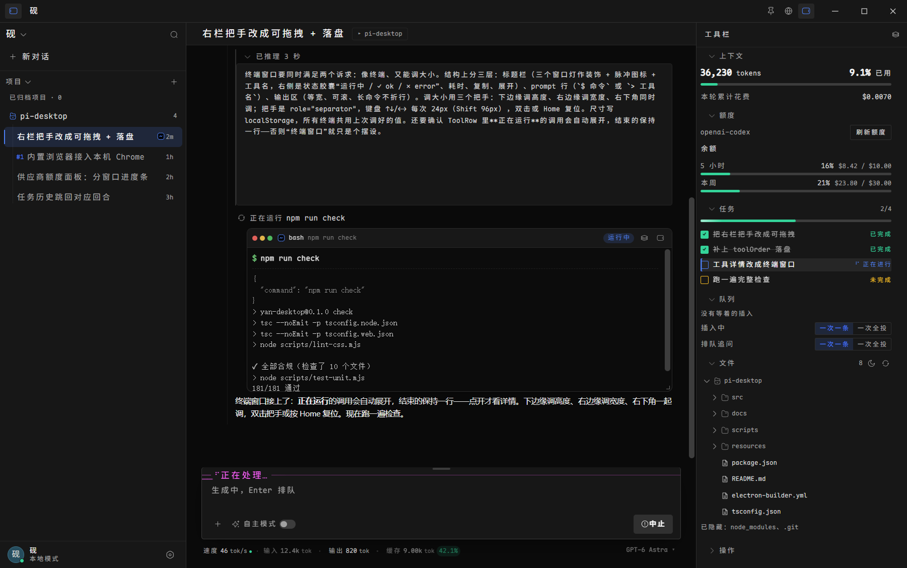

# 砚 · Yan

**一个独立的 agent —— pi 只做内核。**

砚**不是「pi 的前端」**。它自己是一个 agent：会话与项目、输入（`/` 命令 · `@` 文件 · 图片 · `!` shell）、
工具调用的呈现、任务与状态、模型接入、打包分发，**都在应用这一侧**；
pi 只负责模型循环与工具执行（一个 `pi --mode rpc` 子进程）。

它真连 `pi --mode rpc`、真流式、真调工具，并直接复用 pi 的 `~/.pi/agent/sessions/` ——
所以和 pi 的 TUI **互通**（TUI 里聊过的会话桌面端能看到，反之亦然）。


<sub>深色主题，真实会话。右侧是**工具栏**（上下文 / 任务 / 队列 / 文件 / 日志），
输入框顶边框上的 `── ⠙ 正在处理… ──` 是工作状态，边框颜色跟着当前思考强度变</sub>

| 浅色主题 | 设置面板 |
|---|---|
|  |  |

**推理窗口**：模型真的在思考时，回答上方开一个**固定大小的窗口**（约 1/4 屏高），
推理逐字在窗口内滚动；结束后折叠成一行（可再点开）。没有推理就不显示。
思考语言**保持 pi 原装**（模型跟用户的语言走，我们不往提示词里塞任何东西）。



---

## 前置要求

| | |
|---|---|
| **Node** | ≥ 20（开发时用的是 24） |
| **pi** | **已内置，无需自己安装**。运行时随应用分发（`resources/pi-runtime/`，约 20MB） |
| 平台 | Windows 优先（Windows 11 实测）；macOS / Linux 未实测 |

> 砚**不重写 pi 的会话格式**，它直接读 `~/.pi/agent/sessions/` ——
> 所以和 pi 的 TUI 是**互通**的：TUI 里聊过的会话桌面端左侧栏里能看到，反之亦然。
>
> 想用别的 pi 版本（或你全局装的那个）：设置里的 `piBin`，或环境变量 `YAN_PI_BIN`。

---

## 开发环境

```bash
npm install     # 依赖 + 字体（Maple Mono CN 走 npm，不需要额外步骤）
npm run dev
```

应用会自动找 pi 的位置；找不到时跑 `npm run probe-pi` 看诊断。

> **字体**：早期版本要单独跑 `npm run font` 从本地拷一份 18.5MB 的 TTF，
> 而那个源文件同样不入库 —— 结果**新克隆的仓库根本跑不起来**
> （`@font-face` 静默回退，汉字格宽不再是 15.00px，整个等宽栅格塌掉且不报错）。
> 现在改成 npm 依赖 [`@mogeko/maple-mono-cn`](https://www.npmjs.com/package/@mogeko/maple-mono-cn)
> （239 个 `unicode-range` woff2 分片，按需加载），`npm install` 就位。
> 字体 SIL OFL 1.1，可随软件分发。

---

## 谁是 agent，谁是内核

| | 归谁 |
|---|---|
| 模型循环、工具执行（`read/write/edit/bash`）、会话文件格式、RPC | **pi（内核）** |
| 会话与项目管理、输入与斜杠命令、工具调用的呈现、任务/状态/日志、全部界面、模型接入、打包分发 | **砚（agent）** |

为什么这么切：pi 的作者把 pi 定位成「极简内核 + 可被任意 UI 包」，并明确欢迎 fork 与自建 UI。
砚只在内核外面做事，**不往 pi 里塞东西** —— 不给 pi 打补丁、不 import 它的内部模块、
不往 `~/.pi/agent/extensions/` 写文件（用户自己的扩展照常生效）。

> 想换内核（另一个 pi 版本、或你全局装的那个）：设置里的 `piBin`，或环境变量 `YAN_PI_BIN`。

---

## 跑起来

**用户**：双击 `启动-砚.cmd`（开发时用 `开发-砚.cmd`，改渲染层即时生效）。

**开发**：

```bash
npm run launch     # 一条命令：缺依赖会自动装、产物旧了会自动构建，然后启动
npm run launch -- --dry      # 只做检查不启动（排查用）
npm run launch -- --rebuild  # 强制重新构建
```

启动器会补两样**不入库的生成物**（新克隆跑不起来的真正原因）：

| 缺什么 | 启动器怎么做 |
|---|---|
| `node_modules` | 自动 `npm install`（字体是 npm 依赖，不装就没字体） |
| `resources/pi-runtime`（20MB 内置 pi） | 自动跑 `npm run vendor:pi` |

抽内置 pi 要求本机至少装过一个 pi（`npm i -g @earendil-works/pi-coding-agent`）——
这只是**开发时的取材来源**，最终用户不需要装 pi。
`npm run vendor:pi:check` 可单独校验（会真起一次 pi 做 RPC 握手）。

> ⚠️ 面板/界面缩放相关的快捷键：**Ctrl+= / Ctrl+- / Ctrl+0** 缩放界面
> （Ctrl+0 回到「自动」，会按屏幕 DPI 把正文对齐到整数设备像素）。

## 怎么用

| 操作 | 位置 |
|---|---|
| 发消息 | 底部输入框，`Enter` 发送 / `Shift+Enter` 换行 / `Esc` 中止 |
| 生成中插话 | 生成时按 `Enter` 就是 `steer`（下一个回合听你的） |
| 中止并收回排队 | `Esc` —— 先 `clear_queue`，把排队的插话**放回输入框**（不是丢掉） |
| 跑 shell（不经模型） | `!` 开头，如 `!git status`。结果进会话，下一轮对话它能看到 |
| 斜杠命令 | 打 `/` 弹补全（扩展命令 / 提示词模板 / 技能，如 `/panel`）。`/login` 会被路由到「设置 → 模型接入」（pi 的登录是交互式 OAuth，不经 RPC） |
| 发图片 | 直接**粘贴**或**拖进**输入框；也可点输入框左下「+ 图片」 |
| 切会话 / 新建 | 左栏；每行右侧 `⋯` 可**重命名 / 从这里分支 / 打开会话文件 / 删除** |
| 复制会话 / 导出 HTML | 工具栏「操作」分区 |
| 看会话分支 | 左栏会话标题旁的 `⑂ N` 开关（**默认折叠**）→ 展开看每条分支：`#N` + `从「<那句话>」分出去`，点击即切过去；子会话行上也标 `#N` 与来源。**分支创建只在对话窗口里**（用户消息上的「分支」） |
| 看模型的推理 | 回答上方的**推理窗口**：固定约 1/4 屏高、推理逐字在里面滚动；结束后折叠成一行（点标题可再打开）。没有推理就不显示 |
| 工具调用详情 | 一行一条（Codex 风格）；**正在运行**的那条自动展开成**终端窗口**，已结束的保持一行（点开才看详情）。开关见设置 → 外观 → 工具调用详情 |
| 从某条消息分叉 | 鼠标悬停在**用户消息**上 → 「分叉」 |
| 换模型 / 思考档 | `Ctrl+P` 换模型，`Shift+Tab` 换强度（当前模型显示在底部状态条右侧） |
| 压缩上下文 | 工具栏「操作」分区 |
| 缩放界面 | `Ctrl+=` / `Ctrl+-` / `Ctrl+0`（0 = 自动，按屏幕 DPI 对齐整数像素） |
| 换工作目录 | 设置 → 关于里的「工作目录」（pi 的 cwd 是子进程级的，换目录会重启 pi 子进程；界面不会清空） |
| 折叠左栏 | 标题栏**最左上角**的图标（收起 = 0 宽，开关位置从不变） |
| 折叠工具栏 | 标题栏**右侧**、紧邻窗口控制按钮的图标（同样收起 = 0 宽） |
| 切换模式 | 左栏左上角「砚 ⌄」（目前只做了入口：列出的模式除当前外都标「即将支持」） |
| 看运行日志 | 工具栏「日志」分区（pi 的 stderr + 扩展通知） |
| 看项目文件 | 工具栏「文件」分区。**点文件 = 往输入框插 `@路径`**，不是打开文件 |
| 调栏宽 | 拖左栏右缘 / 工具栏左缘（双击复原；聚焦后 ←→ 微调，Shift 更快，Home 复原）。**拖到很窄会自动收起** |
| 调分区顺序 | 拖分区标题左侧的 ⠿ 把手（或聚焦后 Alt+↑↓） |
| 收起不用的分区 | 工具栏标题旁的「工具库」→ 收进库 / 拿回 / 恢复默认布局；**也能从库里直接拖到工具栏**（拖时有落点预览） |
| 调分区高度 | 文件区 / 日志区内容底部的细条（只给会滚动的分区） |
| 看自动压缩时机 | 工具栏「上下文」：进度条上有一条**触发线**，下面写「还差 N tokens」（阈值读 pi 的设置） |
| 显示隐藏文件 | 文件区标题旁的月亮/太阳图标（默认隐藏 .gitignore / node_modules 等） |
| 用斜杠命令 | 打 `/` 搜（命令与说明都能搜）；`↑↓` 选、`Enter`/`Tab` 填入、`Esc` 关。用过的命令会被排到前面 |
| 改名字 / 头像 | 点左栏左下角的头像（12 图标 / 首字 / 12 档色相） |
| 任务进度 | 工具栏「任务」分区（agent 用 `panel_todos` 维护；与 TUI 的 `/panel` 看的是同一份） |

> 尚未接入（README 不写成已有）：**登录**（左栏头像面板里会如实说明是本地模式）。

> `!` 和 `/` 两种模式的角标会显示在输入框左下，不用猜当前是哪一种。

---

## 架构

```
src/
├── main/                        主进程（Node）
│   ├── index.ts                 窗口 + IPC + 生命周期
│   ├── protocol.ts          ⭐ 手写的 pi RPC 客户端（JSONL / 请求响应关联 / 扩展 UI）
│   ├── agent.ts             ⭐ 协议 → UI 的归一化（唯一认识 pi 协议的地方）
│   ├── paths.ts                数据目录（desktop.json）
│   ├── sessions.ts              会话列表（只读扫描 sessions/*.jsonl）
│   └── settings.ts              桌面端设置（不碰 pi 的 settings.json）
├── preload/index.ts             contextBridge 白名单（形态由 YanBridge 类型约束）
├── shared/ipc.ts                主/渲染共享类型 —— 含 MainPush（已归一化的 UI 补丁）
└── renderer/src/
    ├── state/store.ts           zustand：只负责套用 MainPush
    ├── components/              TitleBar / Rail / Continuity / Message / Composer /
    │                            UiBridge（扩展对话框 + 通知 + 日志）
    ├── styles/                  tokens / app / stage1 / electron / highlight
    └── i18n/                    中英双语，类型安全（漏翻译编译报错）
```

### 三条设计原则

**1. 协议知识只存在于 `main/`。**
渲染端只认识 `MainPush`（`msg-add` / `msg-update` / `tool` / `state` / `stats` …）。
`pi update` 改了协议，只改 `protocol.ts` 和 `agent.ts`，组件一行不动。

**2. 不 import pi 的内部模块。**
`dist/modes/rpc/rpc-client.js` 不在 `package.json` 的 `exports` 里。
我们只用子进程 + JSONL，协议按 `docs/rpc.md` 手写。

**3. 不让 shell 碰提示词。**
pi 的入口用 Electron 自带的 Node（`ELECTRON_RUN_AS_NODE=1`）以**参数数组**启动，
不走 `pi.cmd` + `shell:true` —— 否则提示词里的引号、反斜杠、中文可能被 shell 吃掉或注入。

### 数据的存放

```
~/.pi/agent/yan/
└── desktop.json   桌面端设置（窗口/主题/语言/cwd/栏宽）
```

砚**不往 pi 的目录里写东西**（除了这个自己的设置目录）：不碰 `~/.pi/agent/settings.json`、
不碰 `~/.pi/agent/extensions/`、不改会话文件。用户自己的扩展照常生效。

---

## 命令

| 命令 | 作用 |
|---|---|
| `npm run dev` | 开发模式（HMR） |
| `npm run build` / `npm start` | 构建 / 用构建产物启动 |
| `npm run check` | **提交前跑这个**：typecheck + build + 单元测试 + 设计稿溢出 + 30 个真实应用场景（不烧 token） |
| `npm run test:unit` | 纯逻辑单测（110 条，不启动 Electron）：会话解析 / 回合分组 / 段落拆分 / 命中率 / 缩放档位 |
| `npm run test:live` | 全部场景（含 5 个会真调模型的） |
| `npm run test:live -- live features sessions` | 指定场景，不烧 token |
| `npm run test:live -- e2e image queue` | 会花少量额度（真流式 / 真图片 / 真排队） |
| `npm run probe-pi` | 单独验证「pi 能不能被找到并启动」 |
| `npm run icons` | 从设计稿重抽图标 sprite |
| `npm run icon` | 重新生成应用图标 `build/icon.ico` + `icon.png`（离屏渲染，无新依赖） |
| `npm run dist:dir` | 产出免安装目录 `release/win-unpacked/`（调试用，快） |
| `npm run dist` | 出安装包：NSIS `*-setup.exe` + 免安装单文件 `*-portable.exe` |
| `npm run test:packaged` | **验打包产物**：跑 `release/win-unpacked` 里的真实应用，断言用的是包内 pi |
| `npm run dist:check` | `dist:dir` + `test:packaged` 一条龙 |

### 打包分发（Windows）

配置在 [`electron-builder.yml`](electron-builder.yml)，`npm run dist` 出两个东西：

| 产物 | 用途 |
|---|---|
| `砚-<版本>-setup.exe` | NSIS 安装包（可选安装目录、桌面/开始菜单快捷方式） |
| `砚-<版本>-portable.exe` | 免安装单文件版（双击即跑，自解压到临时目录） |

两件**生成物**随包分发（`extraResources` → 安装目录的 `resources/`）：
内置 pi 运行时（20MB）。所以**用户不需要自己装 pi**。

> 体积：安装包约 120MB、免安装目录约 399MB（Electron 本体占大头）。
>
> ⚠️ 改打包配置后**务必跑一次 `npm run test:packaged`** —— 开发态的 30 个场景
> 读的是仓库里的 `resources/pi-runtime`，打包后改从 `process.resourcesPath/` 找，
> 路径错了应用**能启动但连不上 pi**，开发态测试全绿也照样复现不了。

### 测试分三层

| 层 | 工具 | 特点 |
|---|---|---|
| 纯逻辑 | `test:unit`（node） | 快、确定、能断言边界（路径穿越 / 坏数据 / 缓存） |
| UI + 接线 | `test:live`（真实 Electron） | 完整主进程 / preload / IPC / pi 子进程 |
| 真行为 | `test:live -- e2e image queue` | 真模型、真工具、真图片 |

**UI 层不在裸 `BrowserWindow` 里测。** 那样 preload/IPC/pi 全都不存在，
断言会「通过」而应用其实是坏的。

> 完整清单见 `package.json` 的 `check`（共 **30 个场景**，下表只列重点）。

| 场景 | 覆盖 | 花 token |
|---|---|---|
| `live` | 工具栏分区渲染、任务行、三栏宽度、横向/纵向溢出、字体栅格、图标空引用、i18n 裸键 | 否 |
| `panels` | 面板开关位置（在各自面板头部而非标题栏）、工具栏命名、用户档案（名字落盘 / 图标头像 / 色相）、**登录只做预留不做假状态**、左右栏收放 | 否 |
| `symmetry` | 开关的**几何对称性**：展开↔收起**逐像素对比** + `elementFromPoint` 必须命中开关本身 | 否 |
| `zoom` | 界面缩放：DPI 取整（正文落在整数设备像素）、`Ctrl+=/Ctrl+-/Ctrl+0`（**真实按键** `sendInputEvent`）、设置面板档位 | 否 |
| `fs` | 文件树：根层懒加载、目录优先排序、缩进递增、点文件插 `@路径`（带高亮反馈）、跳过 node_modules 并标注、无横向溢出 | 否 |
| `resize` | 面板宽度拖拽：把手位置/方向、松手落盘、双击复原、键盘、范围夹取（拖过头不能产生非法值） | 否 |
| `tools` | 工具栏分区：拖拽排序、Alt+↑↓、工具库（收进库/拿回/恢复默认）、空分区不渲染 | 否 |
| `authEnv` | 凭证写在**环境变量**里时是否被算作已配置（需要场景级 env 注入） | 否 |
| `topbar` | 面板开关在标题栏两端（参考 Codex）：收放时位置不变、收起 = 0 宽、模式菜单入口 | 否 |
| `outlinepos` | 导航轨与**消息列**对齐：收起/展开时「刻度到正文」的距离必须稳定 | 否 |
| `branch` | 会话分叉树（左栏）：无动作按钮 / 标题旁开关**默认折叠** / 展开列出 `#N`+来源 / 点树切过去 / 子行 `#N`+来源 / **切换会话不置顶** | 否 |
| `reasoning` | 推理窗口：真的渲染 / 固定 ~1/4 屏高 / 内容溢出且自动跟随 / 内容变多尺寸不变 / **回合结束前不折叠** / 无推理不占位（24 条断言） | 否 |
| `libdrag` | 从工具库拖到工具栏：实时预览（插入线 + 浮动标签）、拖到外面松手=取消、Esc 取消 | 否 |
| `vheight` | 分区高度可调：哪些分区有把手、拖动实时生效、落盘、范围夹取 | 否 |
| `slashcmd` | `/` 命令：列表过期自动重拉、用过的排前面、Enter/Tab 填充且带尾空格、按键说明可见 | 否 |
| `features` | 斜杠补全、`!bash`（含非零退出码）、图片附件（粘贴/去重/移除）、模型+思考选择器（真切换再切回）、开关、重命名、新建会话可见性 | 否 |
| `todos` | 任务面板：启动期通知不弹窗（只进日志）、清单渲染（进度标签 / 删除线 / 折叠 / 空态不占位） | 否 |
| `sessions` | 切换会话加载历史、选中态、连续性带、新建会话清空 | 否 |
| `virtual` | 注入 240 条 → 只渲染 8 条、滚到底可见最后一项、恢复真实数据 | 否 |
| `e2e` | 流式光标、正文增量、工具卡状态与摘要、智能展开、收尾状态 | 是 |
| `image` | 8×8 红色 PNG 发过去，断言**模型回答「红色」**（证明图片真的进了上下文） | 是 |
| `queue` | 生成中排队 2 条 → `Esc` → 断言队列清空**且文本回到输入框** | 是 |

---

## 关于 pi 的会话

会话直接复用 `~/.pi/agent/sessions/` —— **和 TUI 互通**（这是选它的核心价值）。
左栏只读扫描元数据（标题取首条用户消息、时间、条数），切换会话是让 pi 自己
`switch_session`，我们不复刻它的会话格式。

⚠️ 会话格式当前是 `version: 3`。改格式的 pi 版本可能让列表难看（不至于崩）。

---

## 已知边界

**能用：**
流式对话、markdown + 语法高亮、bash/read/edit/write 工具卡（含彩色 diff）、
多会话（切换 / 新建 / 重命名 / 复制 / 分叉 / 导出 HTML / 删除）、
模型与思考档选择（69 个模型）、上下文压缩、自动压缩与自动重试开关、
图片输入（粘贴 / 拖拽 / 选文件）、`!` 直执行 shell、`/` 斜杠命令补全、
扩展 UI 对话框（select/confirm/input/editor）、扩展通知与状态条、
长会话虚拟化、中英切换、深浅主题、
**Windows 打包分发**（NSIS 安装包 + 免安装单文件版，内置 pi）。

**没做：**
- 浅色主题未打磨（令牌齐全）
- macOS / Linux 打包、代码签名（Windows 优先；未签名安装会有 SmartScreen 提示）
- 跨设备同步（原型里的「已同步 · 桌面·笔记本·手机」是虚构的，已从界面移除）
- 快捷键映射（扩展的 `registerShortcut` 未接）

**与设计稿的差异（有意）：**
- 标题栏中间原来是「记忆已同步 · 桌面·笔记本·手机」，那是虚构状态。
  后来改成**连接状态 + 工作目录**，现在**这两个也去掉了**（用户要求）——
  连接失败有正文上方的提示条，工作目录在设置里看。标题栏中段留空。
- 助手消息仍然无容器（保留不对称），角色靠左侧符号槽：你 = `›`、砚 = `✦`、命令 = `$`。

**实现上的取舍（都是踩过的坑）：**
- **通知限流**：扩展 `notify` 去重 + 最多 3 条。真实扩展（如 `left-info-panel`）会反复通知，
  不去重会直接刷满屏幕。
- **`scrollbar-gutter: stable`**：`overflow-y:auto` 会连带把 `overflow-x` 变 `auto`，
  纵向滚动条一出现就挤窄容器 → 冒出一条横向滚动条。**空状态看不见它**，
  只有数据满了才复现。
- **新建的会话在左栏补一条合成条目**：pi 的会话文件是**懒创建**的，
  空会话不落盘，不补的话点「新对话」左栏毫无反应。
- **虚拟化阈值 80 条**：消息高度是动态的（流式文本在长、工具卡在展开/折叠），
  短会话开虚拟化零收益、风险却真实。
- **`!` 直执行 bash 的工具卡默认展开**：用户主动跑的命令是为了看结果，
  按「成功长输出折叠」的规则藏起来等于白跑。
- **启动期通知只进日志**：扩展大多在启动时发一句「我加载好了」，典型如
  `left-info-panel` 的「信息面板已启用（overlay 44 列）· /panel …」——
  它讲的是 TUI 的 overlay 和命令，在桌面端不适用，开机弹出来只会让人困惑。
  但也不能咽掉，所以进日志抽屉（底部状态条能看到有几条）。
- **测试跑在隔离目录**：`test:live` 会建一个临时 sandbox，
  把 `YAN_USER_DATA`（localStorage）/ `YAN_SESSIONS_DIR`（会话）/ `YAN_DATA_DIR`（桌面端设置）
  全指过去，并从真实会话里**只读拷贝**几份当 fixture。
  不这样做的话测试会改掉你的右栏顺序、往会话目录里塞文件、往设置里写东西 ——
  这几件事都真实发生过。

---

## 参考

| 文件 | 内容 |
|---|---|
| [`docs/README.md`](docs/README.md) | 文档索引（想找什么看这里） |
| [`docs/dev/HANDOFF.md`](docs/dev/HANDOFF.md) | 交接文档：需求、环境事实、踩过的坑 |
| [`docs/dev/NEXT-SESSION.md`](docs/dev/NEXT-SESSION.md) | 新会话开场指令 |
| [`docs/design/DESIGN.md`](docs/design/DESIGN.md) | **设计令牌唯一真源**（tokens.css 必须与它一致） |
| [`docs/design/prototype.html`](docs/design/prototype.html) | 可交互设计稿（浏览器直接打开） |
| pi 的 `docs/rpc.md` | RPC 协议（1618 行，47 命令 / 20+ 事件） |

## 许可证

MIT（见 [`LICENSE`](LICENSE)；末尾附了第三方组件的许可声明）。图标 [reicon](https://github.com/)（MIT），字体 Maple Mono CN（OFL），
代码高亮 highlight.js（BSD-3-Clause）。打包 pi 时需保留其 MIT 版权声明。
