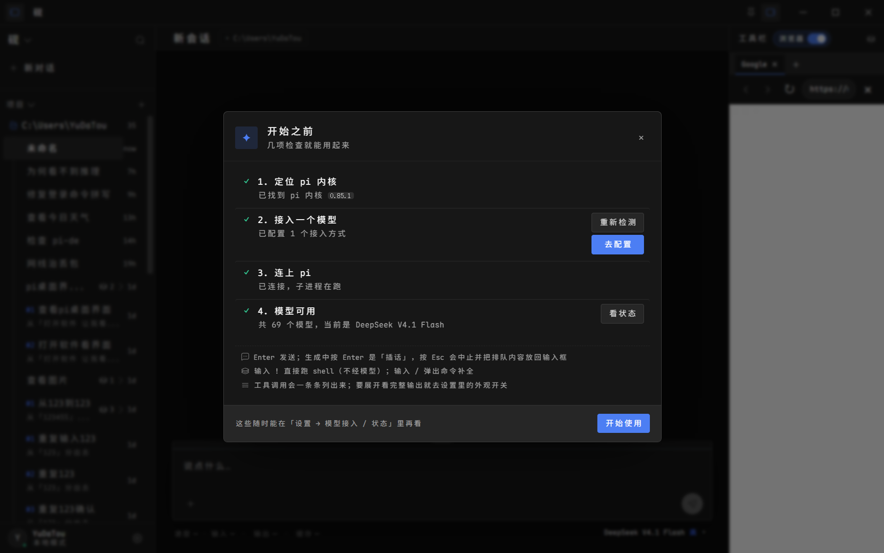

# 内置浏览器 · 定位与引用生命周期修复

日期：2026-09-13
承接：[2026-09-13-browser-implementation.md](2026-09-13-browser-implementation.md)
状态：已完成，并通过真实应用探针回归

前一份记录末尾的「已知未闭环问题」（网页从中栏位置开始、右栏留白）在本轮定位到根因并修复。
同时修掉了排查过程中发现的两个隐藏问题（启动缩放未生效、主进程未捕获异常弹框）。

## 根因与修复

### 1. 原生层坐标少算了一次界面缩放（就是「浏览器位置不对」）

- `WebContentsView.setBounds()` 收的是窗口内容区的 **DIP**，
  而渲染端 `getBoundingClientRect()` 给的是主窗口渲染进程的 **CSS 像素**。
- 两者只在界面缩放 = 100% 时相等：`1 CSS px = zoom DIP`（zoom 来自 `applyZoom`）。
- 漏掉换算后，原生网页被放到「CSS 坐标当 DIP 用」的位置：整体偏左上、还比面板窄一圈，
  缩放越大偏得越狠（125% 屏自动缩放 1.152 时已偏 100px 以上，看起来像跑进中栏）。

修复：`src/main/browser.ts` 的 `setBounds` 按 `win.webContents.getZoomFactor()` 相乘。

证据（isolated 实测，主窗口 zoom=1.5，传 CSS `{x:100,y:50,w:300,h:400}`）：

| | 修复前 | 修复后 |
|---|---|---|
| `nativeBounds` | `{100,50,300,400}`（当 DIP 用） | `{150,75,450,600}` |
| 浏览器页 `innerWidth` | 200（被压扁） | 300（= DOM 元素的 CSS 宽） |

修复前用户实际窗口（网页从中栏位置开始、右栏留白、带横向滚动条）：

### 2. 元素 ref 被任意 DOM 变动打成失效

- 注册表在 `DOM.childNodeInserted` / `childNodeRemoved` 时清空；
  而 `observe` 用 `DOM.getDocument({depth:-1})` 把整棵树推给了客户端，
  之后页面**任何**节点增删都会触发这两个事件。
- 实测：改一次 `document.title`，generation 从 4 跳到 6，刚 observe 的 ref 立刻变 `STALE_ELEMENT`。
  动态页面（广告 / 时钟 / React 重渲染）下点击几乎必定失败。

修复：只在整篇文档被替换（`Page.frameNavigated` / `DOM.documentUpdated`）时作废；
节点真被移除时由 `DOM` 的 detached 报错翻译成 `STALE_ELEMENT`（`actionError`）。

证据：改标题 + append 节点后 generation 仍为 4，ref 可继续使用；
元素被 `remove()` 后调用点击返回 `{ok:false, code:'STALE_ELEMENT'}`。

### 3. 离屏元素点击坐标过期

- `InputController.click` 先 `scrollIntoViewIfNeeded`，却仍用 `observe` 时记录的旧包围盒坐标。
  滚动后元素位置变了，点击发到旧位置（已在视口外），结果是「返回成功但什么都没发生」。

修复：滚动后重新测量包围盒（新增 `src/main/browser/geometry.ts`，Observer 与 InputController 共用）。

证据：页面下方按钮观察时 `y=2002`，点击后滚动到 `y=392`；

| | 修复前 | 修复后 |
|---|---|---|
| 点击后页面标题 | `clicked-top`（未生效） | `clicked-deep` |

### 4. 加载 / 错误提示被原生视图遮住

- 提示原本定位在 `.browser-viewport` 区域内，而网页是原生视图、永远盖在渲染层之上，
  用户根本看不到导航失败。
- 修复过程中又发现：`.browser-surface` 的单列是隐式 `auto`，一条长错误文案
  （如 `ERR_UNSAFE_PORT...`）会把工具栏和网页区从 264px 撑到 483px，连带把原生视图尺寸带歪。

修复：提示移进工具栏内联渲染；`.browser-surface` 固定 `grid-template-columns: minmax(0, 1fr)`。

证据（探针 `scripts/probe/browser.js` 新增两项断言）：
错误提示底边 134.7 < 网页区顶边 147.8（在工具栏内、不会被盖住）；
最终网页区宽度 263.2，与初始一致（不再被内容撑变形）。

## 顺带修复

| 位置 | 问题 | 处理 |
|---|---|---|
| `src/main/index.ts` | 启动自动缩放报告 1.152 但没生效（`loadURL/loadFile` 会重置加载前的 zoom） | 在 `ready-to-show` 后延迟 1.2s 补一次（`did-finish-load` 里同步调会让渲染进程 `render-process-gone: crashed`） |
| `src/main/index.ts` / `shared/ipc.ts` / `store.ts` | 主进程未捕获异常弹 Electron 原生错误框 | 新增 `ch:'log'` 通道，异常/未处理 Promise 进右栏日志抽屉 |
| `src/main/index.ts` | 单实例锁在 `YAN_USER_DATA` 之前获取，隔离实例共抢同一把锁、静默退出 | 把 `setPath('userData')` 提到锁之前 |
| `src/main/browser/InputController.ts` | 空格/数字键码非法；macOS 全选用 Ctrl；滚动固定在 (10,10) 会被固定头部截走 | 键码表、平台化全选、滚动落点取视口中心 |
| `src/main/browser.ts` | `close()` 残留 `nativeBounds`；非法 URL 先建标签页；边删边遍历 `contentView.children` | 关闭时清空 bounds、先校验 URL、遍历副本 |

## 涉及文件

新增：`src/main/browser/geometry.ts`

修改：`src/main/browser.ts`、`src/main/browser/{InputController,Observer}.ts`、
`src/main/index.ts`、`src/shared/ipc.ts`、`src/renderer/src/state/store.ts`、
`src/renderer/src/components/browser/BrowserSurface.tsx`、
`src/renderer/src/styles/redesign.css`、`scripts/probe/browser.js`

## 验证

- `npm run typecheck`（含 CSS 约定检查）
- `npm run build`
- `npm run test:unit`
- `npm run test:live -- browser`（探针新增强化了「错误提示可见」与「区域宽度不变形」两项断言）
- `npm run test:live -- live panels symmetry resize narrow topbar layout outlinepos`（开启启动缩放后的布局回归）

## 遗留与边界

- 自动缩放的补应用在窗口显示后 1.2s 才发生，会有一瞬间未缩放的观感；
  这是为了避开渲染进程崩溃，属于当前 Electron 版本的取舍。
- 点击/输入只做结构化的 ref 操作，不提供任意页面 JavaScript（`/evaluate` 固定 403）。
- 原生视图的整屏截图验证受限：`webContents.capturePage()` 不保证包含子视图，
  `desktopCapturer` 抓窗口时也不含；本轮用「DIP 换算 + 页面 innerWidth」交叉验证。

## 后续追加（同日）

- **「↗ 在外部浏览器打开」按钮**：工具栏加 `yan:browser:openExternal`，
  经 `shell.openExternal` 用系统默认浏览器打开当前地址（只放行 http/https）。
  用于内嵌视图没有登录态时，交给用户自己的浏览器继续。
- **修右栏宽度把手被原生网页遮住**：5px 把手贴在面板左缘，会被原生视图整段盖住，
  浏览器打开时只能从顶部工具栏那一段拖。改为 `.rightpanel.browser-mode .browser-viewport`
  让开 5px，整条边都能抓。

## 未完成（转交下一会话）

用户目标是「用 agent 操作本机已登录的 Chrome（含 ChatGPT 网页版）」，尚未实现。已知约束：

- pi 0.85.1 **无内置 MCP**（官方文档明确），现成 MCP 浏览器服务不能直接接入，需要适配层。
- Chrome 152 禁止对**默认配置目录**开远程调试（已验证）；用独立 `--user-data-dir` 才行。
- 可选路线：(a) 独立 Chrome 配置目录 + CDP，再复用现有 `browser_*` 工具（可靠，但需在独立 profile 登录一次）；
  (b) 自写 Chrome 扩展 + 本地中继，接用户真实 profile（最贴近需求，工作量最大）；
  (c) 给 pi 写一个 MCP-→pi 工具的适配扩展，再用现成 Chrome 扩展（如 Playwright MCP Bridge）。

参见 [HANDOFF.md](../dev/HANDOFF.md) 的「尚未完成」表。
