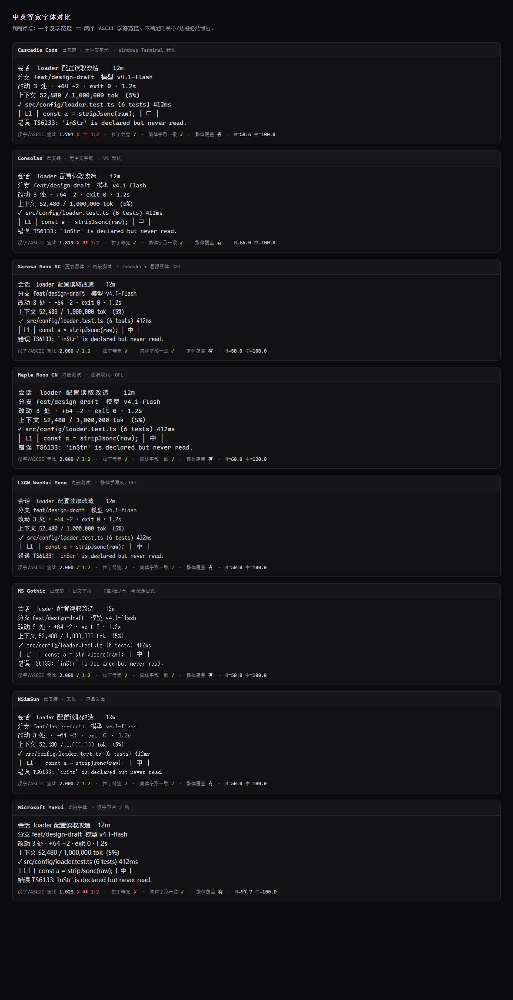

# 字体选型 —— **已定：Maple Mono CN**

> 结论已写入 [`../DESIGN.md`](../DESIGN.md) §2.1。本目录是调研过程与对比工具。

打开 `fonts.html` 自己对比（**必须从本目录打开**，字体是相对路径引用）。
打开 `maple-size.html` 看 Maple 四档字号的实际效果。



---

## 最终决定

| | |
|---|---|
| 字体 | **Maple Mono CN**（Regular 为主） |
| 拉丁列宽 | `0.600em` |
| 汉字宽 | `1.200em` |
| 比值 | **2.000**（严格 1:2）✓ |
| 基准字号 | **12px**（不是 13px） |
| 授权 | SIL OFL 1.1 —— 可随软件分发 |
| 来源 | https://github.com/subframe7536/maple-font |

### 为什么是 12px 不是 13px

因为 Maple 的列宽是 **0.6em**，比 Cascadia 的 0.586em 宽一点。
同一个列宽下字号要小一档：

| 字号 | 列宽 | 汉字 | 780px 可容列数 | 拉丁密度（基准 Cascadia 13px） |
|---|---|---|---|---|
| 11px | 6.61px | 13.20px | 118 | 115% |
| 11.5px | 6.91px | 13.81px | 112 | 110% |
| **12px** | **7.20px** | **14.41px** | **108** | **106%** |
| 12.5px | 7.50px | 15.00px | 104 | 102% |
| （旧）Cascadia 13px | 7.62px | — | 102 | 100% |

### 连带调整

- 字号阶整阶下调 ~8%：`10 / 11 / 12 / 12.5 / 14`
- 行高上调：`--lh-tight 1.35 → 1.45`，`--lh-base 1.6 → 1.65`
  因为 Maple 的汉字字面框就是 1.2em，比常见字体高，旧行高会贴得过紧
- 连字默认关（UI）/ 开（代码）—— 连字**不改变字符宽度**，不影响对齐

---

## 调研过程（保留备查）

### 为什么不能"用 Cascadia + 中文回退"

终端风格 UI 的命门是**栅格对齐**：一个汉字必须正好占两个 ASCII 字符宽，
否则表格、边框、diff 标记全部错位。

```
要求：  汉字宽 ÷ ASCII 宽 == 2.000
```

常见英文字体的 ASCII 宽 **不是 0.5em**，所以永远凑不出 2.000：

| 字体 | ASCII 宽 | 中文字宽 | 比值 |
|---|---|---|---|
| Cascadia Code | 0.586em | 1.000em | **1.707** ✗ |
| Consolas | 0.550em | 1.000em | **1.819** ✗ |
| Microsoft YaHei | 0.977em | 1.000em | **1.023** ✗ |
| **Sarasa Mono SC** | **0.500em** | **1.000em** | **2.000** ✓ |
| **Maple Mono CN** | 0.600em | 1.200em | **2.000** ✓ |
| **LXGW WenKai Mono** | 0.500em | 1.000em | **2.000** ✓ |

**结论：必须选「拉丁部分本来就是 0.5em」的字体**，不能靠回退拼装。
（想凑 2.000 需要中文字体宽度 1.172em —— 不存在这种字体。）

---

### 当时的三个候选

| | Maple Mono CN ✅ | Sarasa Mono SC | LXGW WenKai Mono |
|---|---|---|---|
| 字形 | 黑体，圆润现代 | 黑体（思源黑体） | **楷体，手写风** |
| 拉丁来源 | JetBrains Mono 系 | Iosevka | 自绘 |
| ASCII 宽 | 0.6em | **0.5em** | 0.5em |
| 13px 下 780px 能放 | 100 字符 | **120 字符** | 120 字符 |
| 连字 | **有** | 无 | 无 |
| 授权 | SIL OFL 1.1 | SIL OFL 1.1 | SIL OFL 1.1 |
| 全量 TTF | 17.7 MB | 24.7 MB | 24.4 MB |
| 现成子集 woff2 | 需自己切 | **2.2 MB**（`sarasa-mono-web`） | 无 |

**选了 Maple**：字形最现代，中英比例协调。
代价：列宽 0.6em → 同宽下比 Sarasa 少放 ~17% 字符；且无现成子集 woff2，得自己切。

---

## 体积方案（待办）

Maple Mono CN 的 Regular 单字重就是 **17.7 MB**，必须做子集。

| 方案 | 预计体积 | 说明 |
|---|---|---|
| `cn-font-split`（npm） | ~2–3 MB | 按 unicode range 切成 woff2 分片，按需加载。**推荐** |
| `pyftsubset`（fontTools） | ~300 KB–1 MB | 按用到的字符精确切。中文文案固定，可切得很小 |
| 直接打包全量 TTF | 17.7 MB | 能跑，但为一个 UI 字体不值得 |
| 检测系统已装 + 回退 | 0 | ❌ 用户没装就掉到非等宽，栅格崩 |

> 参考做法：`sarasa-mono-web` 就是这么切的（2.2 MB / 60+ 分片）。

### 原型阶段先用全量 TTF

设计稿 `prototype.html` 直接引用：
```css
@font-face{font-family:"Maple Mono CN";
  src:url("./font-test/MapleMono-CN-Regular.ttf") format("truetype")}
```
本目录的 `.ttf` 已 gitignore，不进仓库。

---

## 需要注意

- **截图里的彩色边缘**是 Windows 次像素抗锯齿，不是字体问题。
  应用里加 `-webkit-font-smoothing: antialiased` 换成灰度抗锯齿即可。
- **别用 `font-family: monospace` 兜底**：各平台解析结果不同，Windows 会掉到
  Courier New。必须显式写字体名 + 最后兜底 `monospace`。
- 若最终选 Maple，`0.6em` 步进意味着**同样的 `font-size` 视觉上大 20%**，
  要相应调小 `font-size`（13px → 11px 左右）。

---

## 复现

```bash
# Maple Mono CN（已选定）
curl -L -o MapleMono-CN.zip \
  https://github.com/subframe7536/maple-font/releases/download/v7.9/MapleMono-CN.zip
unzip -j MapleMono-CN.zip MapleMono-CN-Regular.ttf -d .

# 备选（已否决，保留复现路径）
npm pack @fontpkg/sarasa-mono-sc      # 130 MB 包，内含 10 个字重
npm pack sarasa-mono-web              # 2.2 MB，已子集 woff2
curl -L -O https://github.com/lxgw/LxgwWenKai/releases/download/v1.522/LXGWWenKaiMono-Regular.ttf
```

> 本目录下的 `.ttf` 只是为了本地对比，**不要提交进仓库**（见 `.gitignore`）。
